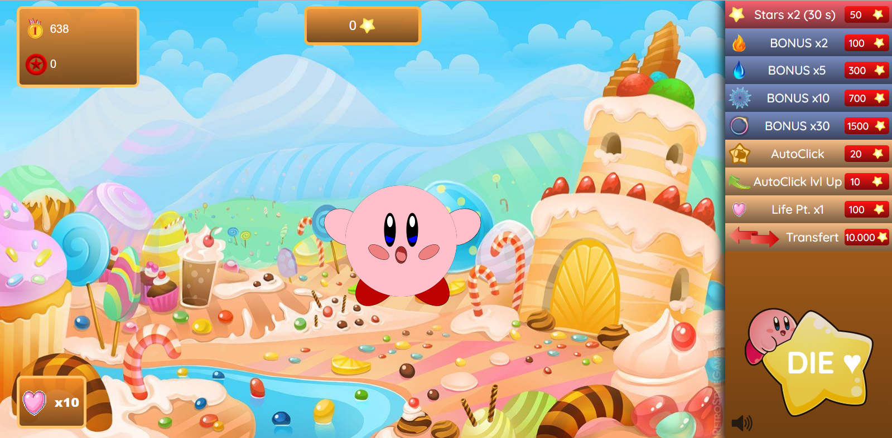
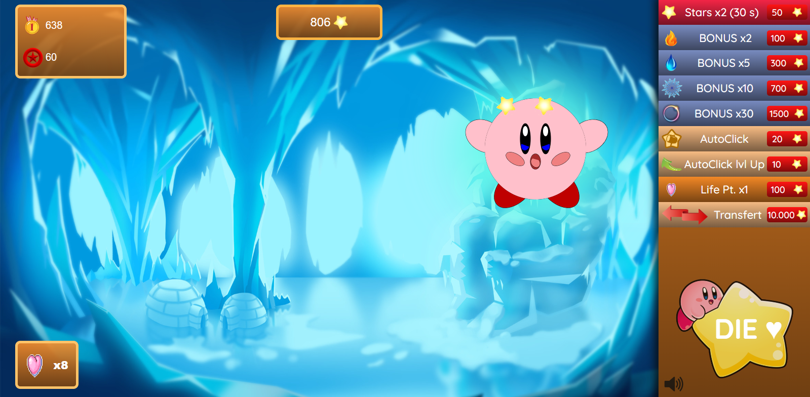
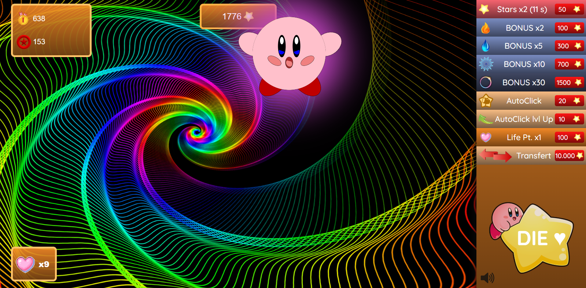

# KirbyClicker

Jeu d'arcade type Cookie Clicker version Kirby.

**A quoi ça ressemble ?**
[Demo](https://memo097.github.io/KirbyClicker/)

## GamePlay
La particularité du Kirby Clicker est qu'il est possible de perdre. Vos points de vie chuteront à chaque fois que vous manquerez Kirby qui ne vous facilitera pas la tâche en bougeant de manière aléatoire! Pour vous aider dans cette épreuve :

- Des multiplicateurs de points
- Un autoclick (que vous pouvez améliorer)
- L'achat de points de vie (Kirby en donne de temps en temps)
- Un système de transfert d'étoiles vers votre score

Une fois les différents niveaux franchis, accumulez les points et tentez de battre le meilleur score!

## Technologies/Langages
* Html
* Css
* JavaScript

## Dev Team
* **Ayoub Ochan**
* **Mike Hanon**
* **Aleksandra Tarchini**
* **Samuel Reyniers**
* **Mehmet Ozcan**