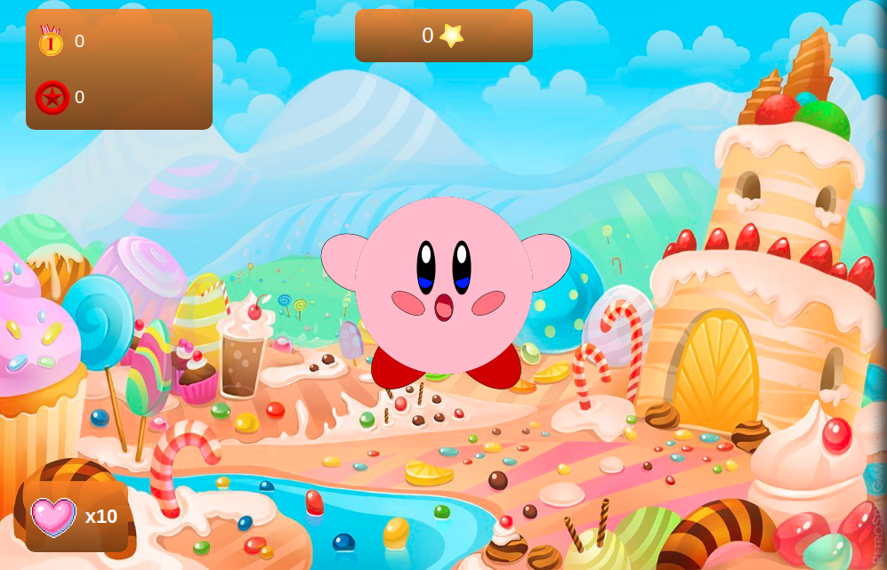
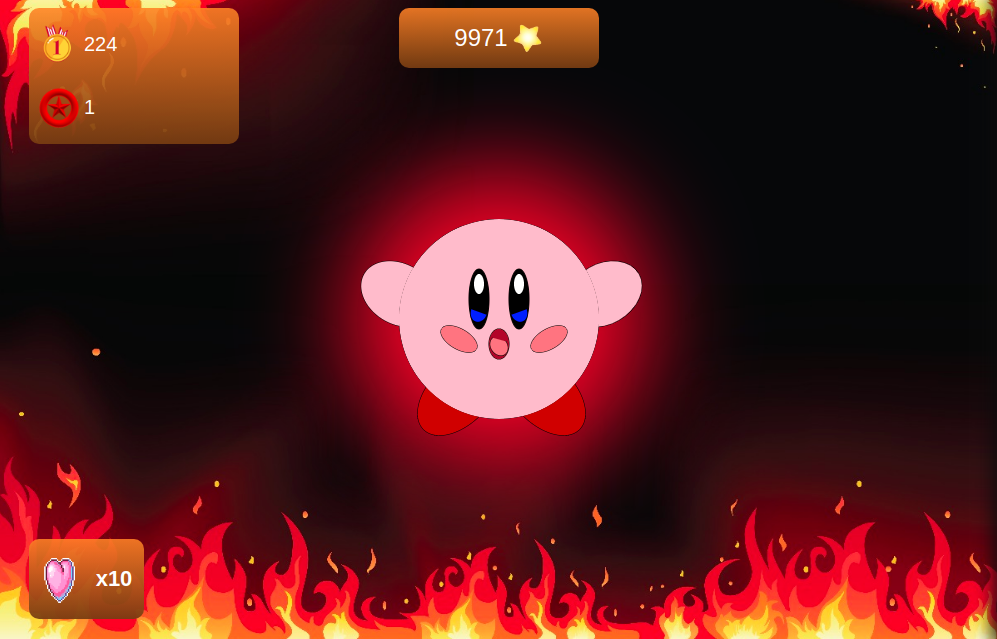
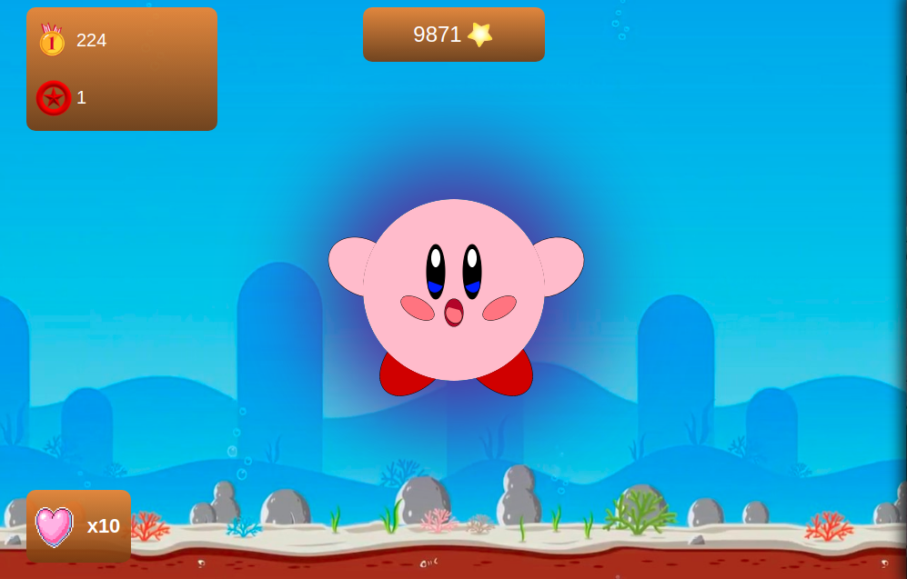
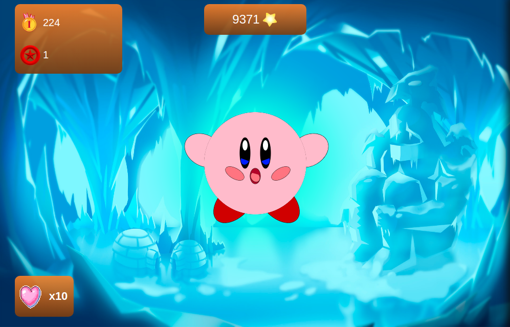
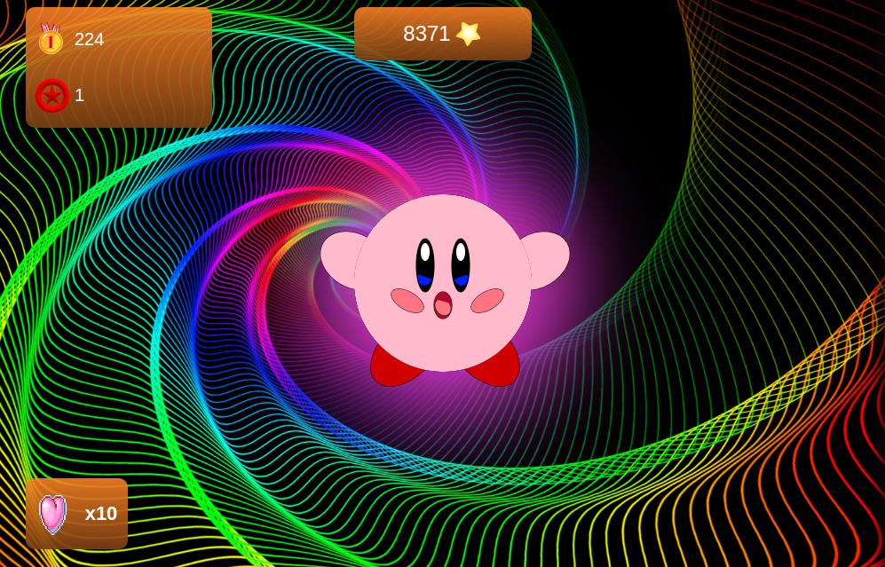

# KirbyClicker

Exercice Cookie Clicker refaire dans le cadre dans la formation BeCode. Nous avons décider de faire une version KirbyClicker en mode Arcade.

**A quoi ça ressemble ?**
[Demo](https://memo097.github.io/KirbyClicker/)

## Prise en main
Une version KirbyClicker, le kirby a été dessiné en **Canvas**, il se déplace aléatoirement sur la page. A chaque clique vous gagnez une étoile si vous ratez votre clique et que vous cliquez ailleurs que sur le Kirby vous perdez une vie. Votre vie de départ est de dix, si vos points de vie atteignent zéro, ce sera un **GAME OVER** et vous aurez la possibilité de recommencer le jeux avec le bouton Try Again. Vous pouvez en gagner de manière aléatoire ou en acheter dans la boutique en échange d'étoile comme d'autre bonus qui peuvent multiplier vos gains d'étoile par clique (x2, x5, x10, x30) a chaque bonus acheter le décor changera. Votre meilleur score reste affiché afin que vous puissiez essayer de vous surpasser.Il y a aussi le bonus Autoclick qui va cliquer pour vous dix fois et un bonus qui permet de d'augmenter la durée de l'Autoclick celui-ci possède trois niveaux. De plus il y a aussi un bonus x2 de trente secondes qui multiplie tout vos récolte d'étoile.

## Construit avec
* Html
* Css
* JavaScript

## Auteurs
* **Ayoub Ochan**
* **Mike Hanon**
* **Aleksandra Tarchini**
* **Samuel Reyniers**
* **Mehmet Ozcan**

[La liste des Contributeurs](https://github.com/memo097/KirbyClicker/graphs/contributors)
